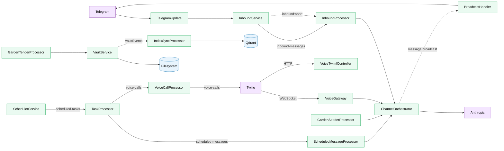

# Murph

A personal AI assistant built on NestJS, powered by Claude. Connects via Telegram and voice calls, backed by a filesystem markdown vault with vector search.

## Architecture

### Legend

| Line Style | Meaning |
|---|---|
| **Solid with label** (`── "queue" ──`) | BullMQ queue (routed through AgentDispatcher) |
| **Dashed** (`╌╌`) | EventEmitter or Redis Pub/Sub |
| **Solid, no label** | Direct function call |

### Communication Details

**BullMQ Queues** — All queues use Redis and are registered with `AgentDispatcher` (central routing hub) unless noted.

| Queue | Producer | Consumer |
|---|---|---|
| `inbound-messages` | InboundService | InboundProcessor |
| `scheduled-tasks` | SchedulerService | TaskProcessor |
| `scheduled-messages` | TaskProcessor | ScheduledMessageProcessor |
| `voice-calls` | TaskProcessor / VoiceCallFactory tool | VoiceCallProcessor |
| `garden-seeder` | SeedToolFactory tool | GardenSeederProcessor |
| `index-sync` | VaultEvents (self-managed) | IndexSyncProcessor |
| `garden-tending` | Cron / manual trigger (self-managed) | GardenTenderProcessor |

**Events & Pub/Sub**

| Channel | Type | Purpose |
|---|---|---|
| `message.broadcast` | EventEmitter | Delivers outbound messages to BroadcastHandler |
| `VaultEvents` (created/changed/deleted) | EventEmitter | Triggers index sync to Qdrant |
| `inbound:abort` | Redis Pub/Sub | Cancels in-flight LLM calls on new message |

**External Integrations**

| Service | Used By | Purpose |
|---|---|---|
| Anthropic | LlmService | LLM inference (Claude) |
| OpenAI | IndexSyncProcessor | Embeddings for vector search |
| ElevenLabs | TranscriptionService | Audio transcription |
| Exa | ChannelOrchestrator (tool) | Web search |
| Twilio | VoiceCallProcessor, VoiceGateway | Outbound/inbound voice calls |
| Telegram | TelegramUpdate, BroadcastHandler | Chat transport |

**Data Stores**

| Store | Purpose |
|---|---|
| Redis | BullMQ queues, Pub/Sub, conversation history, scheduler state |
| Qdrant | Vector index for semantic search over vault notes |
| Filesystem | Markdown vault (plain `.md` files, watched via `fs.watch`) |
